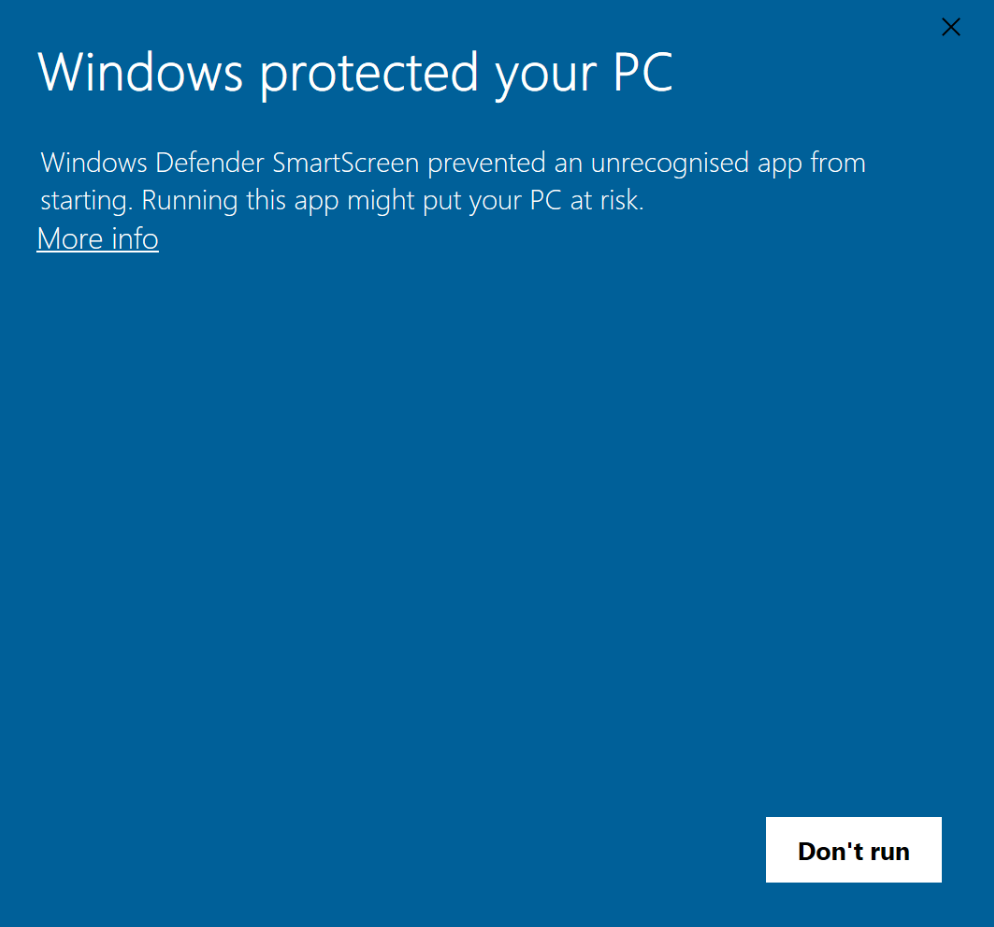

# 

# Security
You are not likely to see this, but if you see a Windows Defender SmartScreen warning, it means that you are on Windows 10. This transformation pack is NOT designed for Windows 10 as it it fully made for Windows 7. I do not recommend you open the executable on your main machine as it will give a false positives. Only try to install this transformation pack on a [Virtual Machine](https://en.wikipedia.org/wiki/Virtual_machine)

### <h1 align="center"></h1>
